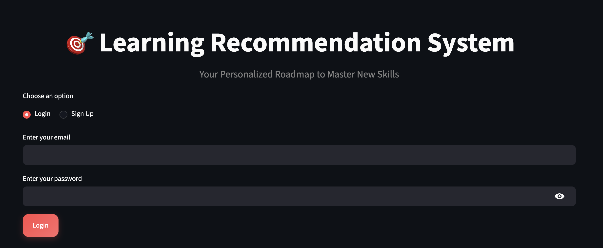
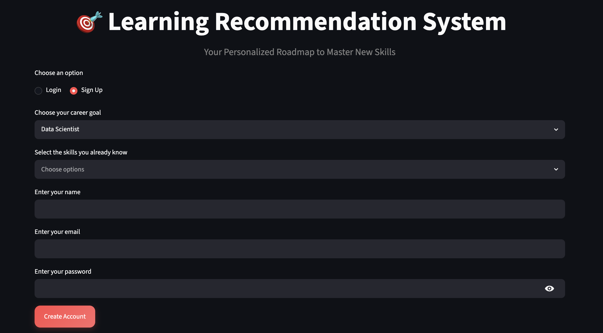
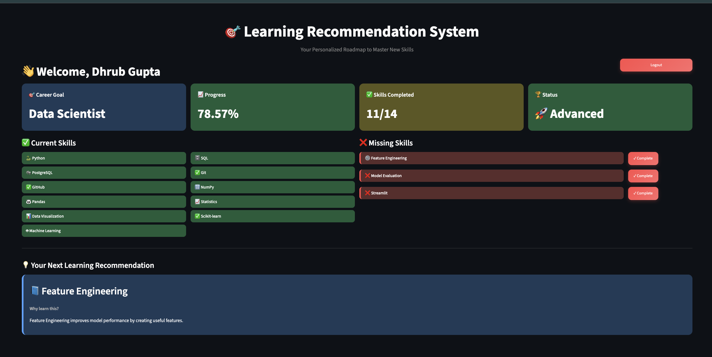

# 🎯 Learning Recommendation System

🔗 **Live Demo:** https://learning-recommendation-system-qtutcedpmletnqikvxs4zy.streamlit.app/

💻 **GitHub Repository:** https://github.com/dhrubgupta/learning-recommendation-system

A personalized learning recommendation web application built with **Python**, **Streamlit**, and **PostgreSQL**.

The system allows users to create an account, securely log in, track their learning progress, view completed and missing skills, receive personalized learning recommendations, and follow a structured roadmap toward their career goals.

## ✨ Features

- 👤 User Registration and Login
- 🔐 Secure Password Hashing using bcrypt
- 🎯 Career Goal Selection
- 📊 Learning Progress Dashboard
- ✅ Current Skills Tracking
- ❌ Missing Skills Detection
- 💡 Personalized Learning Recommendations
- 📈 Progress Percentage Calculation
- 🚪 Logout Functionality
- 🗄 PostgreSQL Database Integration
- 🌙 Modern Dark Theme UI

## 🛠️ Technologies Used

| Technology | Purpose |
|------------|---------|
| Python | Backend Programming |
| Streamlit | Web Application Framework |
| PostgreSQL | Database Management |
| SQL | Database Queries |
| psycopg2 | PostgreSQL Connectivity |
| bcrypt | Password Hashing |
| python-dotenv | Environment Variable Management |
| Git | Version Control |
| GitHub | Code Hosting |

## 🚀 Installation

### 1. Clone the Repository

```bash
git clone https://github.com/YOUR_USERNAME/Learning-Recommendation-System.git
```

### 2. Navigate to the Project Folder

```bash
cd Learning-Recommendation-System
```

### 3. Install Dependencies

```bash
pip install -r requirements.txt
```

### 4. Create a `.env` File

```env
DB_HOST=localhost
DB_NAME=learning_recommendation
DB_USER=postgres
DB_PASSWORD=your_database_password
```

### 5. Run the Application

```bash
streamlit run app.py
```

## 📸 Application Screenshots

### 🔐 Login Page



---
### 📝 Registration Page




### 📊 Dashboard

